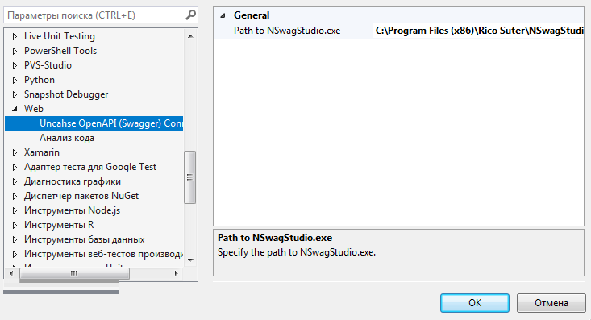

# Unchase.OpenAPI.ConnectedService

[Unchase OpenAPI (Swagger) Connected Service](https://marketplace.visualstudio.com/items?itemName=Unchase.unchaseOpenAPIConnectedService) is a Visual Studio extension to generate `C#` (`TypeScript`) `HttpClient` (`Controller`) code for `OpenAPI` (formerly [`Swagger API`](https://swagger.io/docs/specification/about/)) web service with [NSwag](https://github.com/RSuter/NSwag).

  

The project is developed and maintained by [Nikolay Chebotov (**Unchase**)](https://github.com/unchase).

# Features
- Generate `C#` or `TypeScript` clients/proxies (client code) from Swagger 2.0 and OpenAPI 3.0 specifications from C# ASP.NET (Core) controllers
- Generate `C#` Controller from Swagger 2.0 and OpenAPI 3.0 specifications
- Generate `.nswag` file for using in [`NSwagStudio`](https://github.com/NSwag/NSwag/wiki/NSwagStudio) (no need to install for generating)
- Add required dependencies for the `C#` client (before generating):
	- Library targeting .NET Standard 1.4+:
		1. Newtonsoft.Json ([NuGet](https://www.nuget.org/packages/Newtonsoft.Json))
		2. System.Net.Http ([NuGet](https://www.nuget.org/packages/System.Net.Http))
		3. System.ComponentModel.Annotations ([NuGet](https://www.nuget.org/packages/System.ComponentModel.Annotations))
	- Library targeting the full .NET:
		1. Newtonsoft.Json ([NuGet](https://www.nuget.org/packages/Newtonsoft.Json))
		2. System.Runtime.Serialization (GAC)
		3. System.ComponentModel.DataAnnotations (GAC)
	- Library targeting PCL 259 (Portable Class Library):
		1. Newtonsoft.Json ([NuGet](https://www.nuget.org/packages/Newtonsoft.Json))
		2. Microsoft.Net.Http ([NuGet](https://www.nuget.org/packages/Microsoft.Net.Http))
		3. Portable.DataAnnotations ([NuGet](https://www.nuget.org/packages/Portable.DataAnnotations))
- Add Required dependences for the `C#` controller (before generating):
	1. Microsoft.AspNetCore.Mvc ([NuGet](https://www.nuget.org/packages/Microsoft.AspNetCore.MVC))
- Storage of the last 10 endpoints (json-specification path)

# Getting Started

  

Install from `Tools -> Extensions and Updates` menu inside [Visual Studio](https://visualstudio.microsoft.com/vs/) (including 2019) or [download](http://vsixgallery.com/extensions/Unchase.OpenAPI.ConnectedService.63199638-6211-4285-ba8f-75b1f0326c2a/extension.vsix)  as `VSIX` package from VSGallery or [download](https://marketplace.visualstudio.com/items?itemName=unchase.unchaseOpenAPIConnectedService)  as `VSIX` package from Visual Studio Marketplace:

# Settings Meaning

Meaning of the Unchase OpenAPI (Swagger) Connected Service settings according to [NSWagStudio](https://github.com/NSwag/NSwag/wiki/NSwagStudio):

# Open in NSwagStudio Command

Since *v1.1.** was added menu command embedded in Visual Studio Solution Explorer context menu lets you open generated `.nswag` and `.nswag.json` files in [NSWagStudio](https://github.com/NSwag/NSwag/wiki/NSwagStudio).

This extension is for those times where you generate `.nswag` and `.nswag.json` files and you want to be able to quickly open it in [NSWagStudio](https://github.com/NSwag/NSwag/wiki/NSwagStudio).

## Prerequisite

In order to use this extension, you must have [Visual Studio](https://visualstudio.microsoft.com/vs/) 2017/2019, this connected service as well as [NSWagStudio](https://github.com/NSwag/NSwag/wiki/NSwagStudio) installed.

## Solution Explorer

You can open `.nswag` and `.nswag.json` files in NSwagStudio by simply right-clicking it in Solution Explorer and select **Open in NSwagStudio**:

## Path to NSwagStudio.exe

If you installed [NSWagStudio](https://github.com/NSwag/NSwag/wiki/NSwagStudio) at a non-default location, a prompt will ask for the path to `NSwagStudio.exe`.

You can always change the location in *Tools -> Options -> Web -> Unchase OpenAPI (Swagger) Connected Service*:

# HowTos
- [ ] Add HowTos in a future

# Troubleshooting
## Can't open .nswag file in NSwagStudio
- You can use **Open in NSwagStudio** menu command
- If generated code corrupted, try to open `.nswag` file in [`NSwagStudio`](https://github.com/RSuter/NSwag/wiki/NSwagStudio) (Windows GUI for editing .*nswag files)
- If it doesn't open, try to create new `.nswag` file in [`NSwagStudio`](https://github.com/RSuter/NSwag/wiki/NSwagStudio) for the same API service link and check the differences

# Roadmap
See the [changelog](CHANGELOG.MD) for the further development plans and version history.

# Feedback
Please feel free to [request a feature](https://github.com/unchase/Unchase.OpenAPI.Connectedservice/issues/new?title=FEATURE) or [report a bug](https://github.com/unchase/Unchase.OpenAPI.Connectedservice/issues/new?title=BUG). Thank you in advance!

----------

Copyright &copy; 2019 [Nikolay Chebotov (**Unchase**)](https://github.com/unchase) - Provided under the [MIT License](LICENSE.md).

